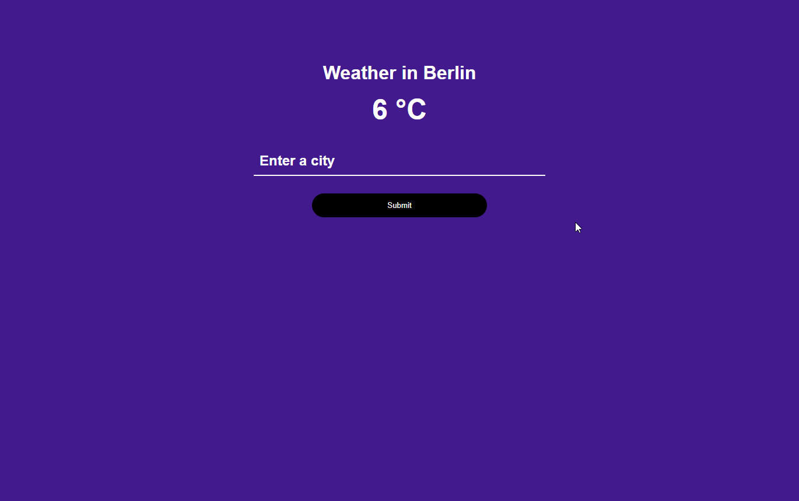

# Python API Proxy Server

A simple proxy server built with Flask (Python). It can be used for hiding API keys as well as rate limiting. This uses the [OpenWeather API](https://openweathermap.org/api), but you can easily change it to whatever public API you want. The project
is a spinoff of Brad Traversy's [Node API Proxy Server](https://github.com/bradtraversy/node-api-proxy-server).



## Usage

To install the dependencies you need to have [Pipenv](https://pipenv.pypa.io/en/latest/).

### Install dependencies

```bash
pipenv install
```

### Run on http://localhost:5000

```bash
flask run
```

### Run tests

```bash
pytest
```

### Add public API info

Rename **.env.example** to **.env** and edit the values

If the public API URL is **https://api.openweathermap.org/data/2.5/weather?q={city}&appid={APIkey}**

- API_BASE_URL = "https://api.openweathermap.org/data/2.5/weather"
- API_KEY_NAME = "appid"
- API_KEY_VALUE = "YOUR API KEY"

You can add on any other query params as needed when hitting the /api endpoint such as https://yourdomain/api?q=Berlin without having to add your key in the client.

- Add new routes as you see fit
- Change rate limiting

This project is inspired by Brad Traversy's [YouTube tutorial](https://youtu.be/ZGymN8aFsv4).